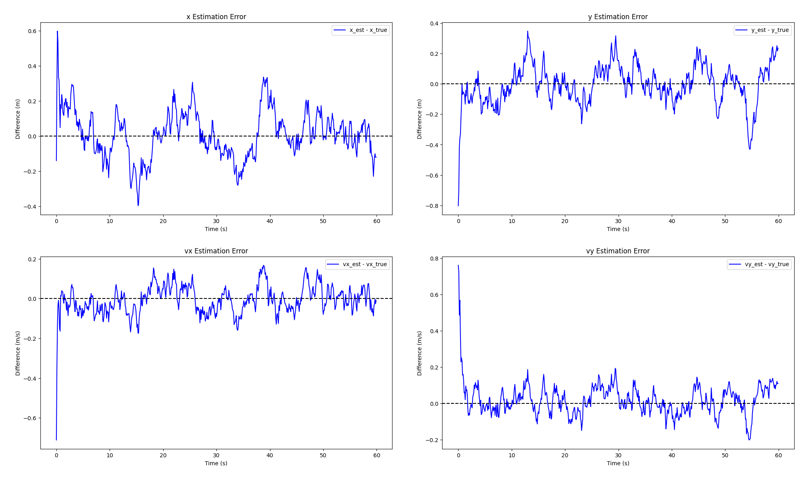
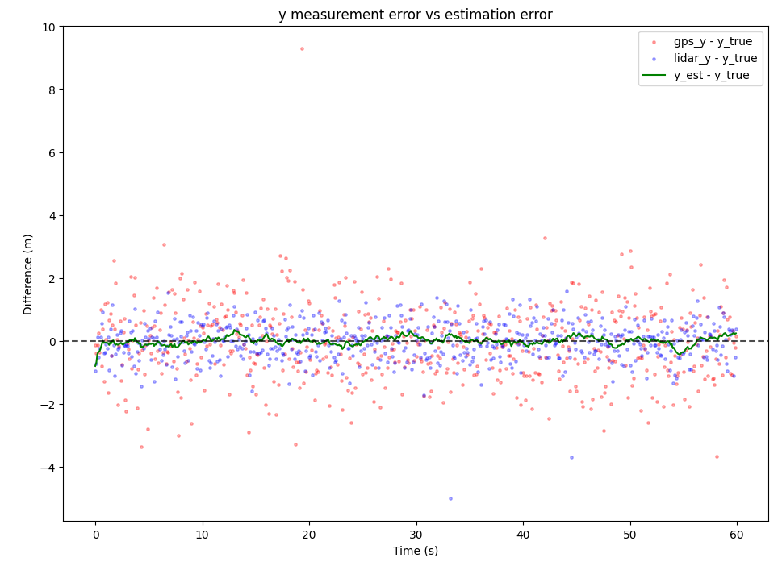

# What is this?

**Linear Kalman filter for 2D constant-velocity tracking with multi-sensor fusion and dropout handling.**

This demo simulates the trajectory of a self-driving truck equipped with sensors (IMU, GPS and LiDAR) and uses a Kalman filter to estimate this trajectory.
Simulation and estimates are output to a `.csv` file and plotted with the accompanying Python script.

# Technical highlights
- Simulates trajectory (straight line or circle for now) without process noise, but with noisy measurements from an IMU, GPS and LiDAR.

- Simulation includes random events where sensors can be unavailable or return garbage data. Estimation includes logic detecting garbage data and excluding these sensors at the fusion step.
    - Rather than excluding based on a naive distance threshold (ignore the sensor if its measurement is sufficiently far from the estimate), normalize this distance vector by its covariance matrix and do a [$\chi^2$ test](https://kalman-filter.com/normalized-innovation-squared/) to determine exclusion. In other words, weight the difference by its uncertainty.

- Sensors are implemented as instances of a struct, allowing for greater modularity when adding sensors to the simulation.

- Plots showing effect of the filter.

# Instructions
- Dependencies: [Eigen](https://libeigen.gitlab.io/) and Python with numpy, pandas and matplotlib.
- To run it, clone the repo and then `g++ -std=c++17 KalmanDemo.cpp KalmanFilter.cpp -o kalman_demo && ./kalman_demo` followed by `python3 plot_filter.py`.

# To do

- Unit tests

- Add process noise

- Add control input

- Add more trajectories (e.g. lane change, stop and go, slamming the brakes)