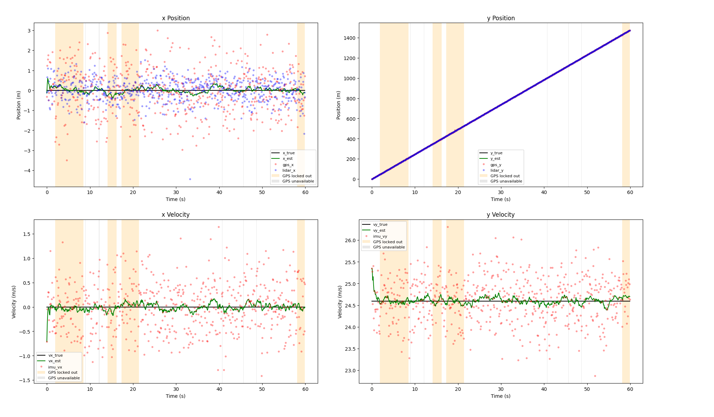
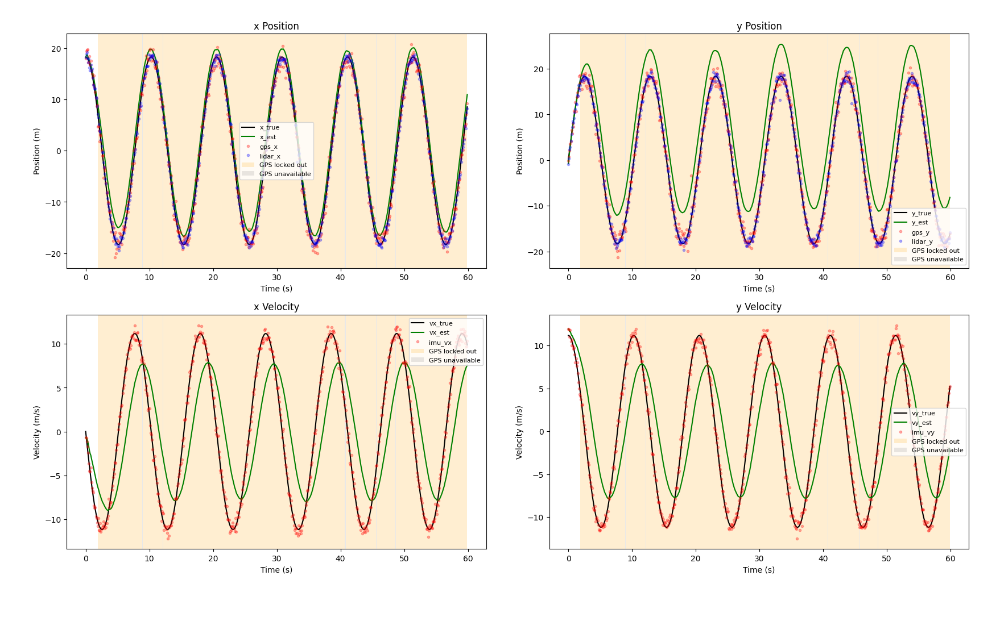
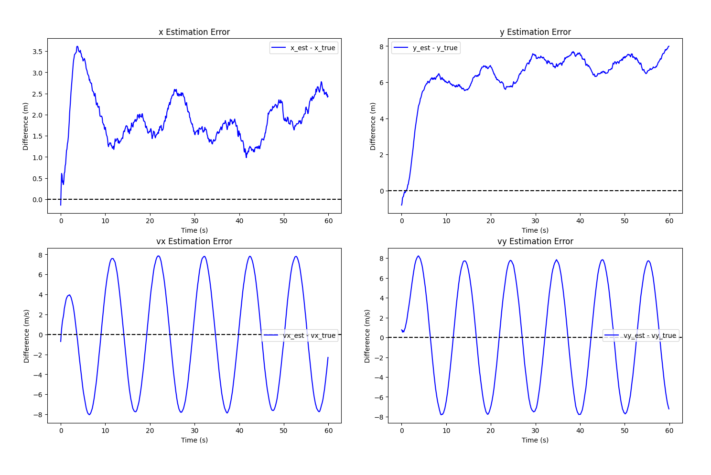
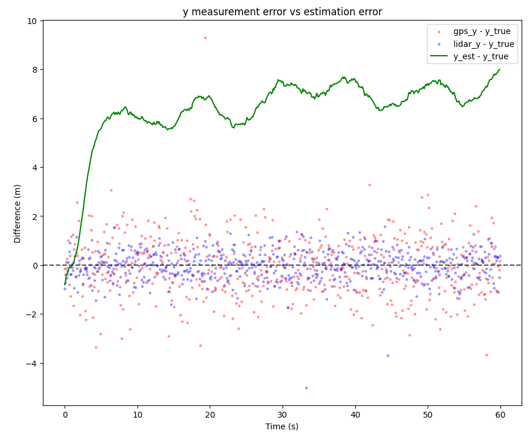

# What is this?

**Linear Kalman filter for 2D constant-velocity tracking with multi-sensor fusion and dropout handling.**

This demo simulates the trajectory of a self-driving truck equipped with sensors (IMU, GPS and LiDAR) and uses a Kalman filter to estimate this trajectory.
Simulation and estimates are output to a `.csv` file and plotted with the accompanying Python script.

# Background
I was presented with a toy version of state estimation code for an autonomous truck during a job interview.
There, we had a truck with three sensors: an IMU measuring _world frame $x$ and $y$ velocity_, and a GPS and lidar both measuring world frame $x$ and $y$ position.
The task was to fuse the measurements from the three sensors into an estimate for the position via a simple weighted average (with constant, known weights).
There were also rules for when to exclude the GPS or lidar sensors from the average: if one of these sensors either reports itself as unavailable or its measured position differs from the estimate by at least some constant threshold, we exclude it.
Furthermore, if we exclude the GPS by this later criterion, we reject its measurements for a fixed lockout period.

As a sort of practice project, I wanted to refine this toy problem by simulating the truck's trajectory and the sensor measurements, as well as fusing the measurements via a Kalman filter rather than a simple weighted average.

# Initial model - constant velocity
- Constant velocity model
- Kalman filter
- No process noise, only measurement noise.
- No control input
- Replace constant threshold criterion for dropout with chi-square criterion.

# Constant velocity model results
- Simulation includes random events where sensors can be unavailable or return garbage data. Estimation includes logic detecting garbage data and excluding these sensors at the fusion step.
    - Rather than excluding based on a naive distance threshold (ignore the sensor if its measurement is sufficiently far from the estimate), normalize this distance vector by the innovation covariance matrix and do a [$\chi^2$ test](https://kalman-filter.com/normalized-innovation-squared/) to determine exclusion. In other words, weight the difference by its uncertainty.

- Sensors are implemented as instances of a struct, allowing for greater modularity when adding sensors to the simulation.

## Performance on straight line trajectory - looks good

The first plot shows that the filter cuts through the noise quite well. The second plot quantifies this a bit better, showing that the $x$ and $y$ position estimates are accurate within about half a meter and the velocities are accurate within 0.2 m/s. The third plot compares the filter estimate versus just the measurements, showing that the filter outperforms just measurement.

## Performance on circle trajectory - looks bad

Things look a lot more grim on the circle trajectory. The first plot shows that the filter consistently over-estimates the $y$ position and the magnitudes of the $x$ and $y$ velocities are both consistently underestimated and lagged. The second plot shows that the $x$ estimate error hovers around +2m and the $y$ estimate error is between 6m and 8m with the velocity errors tracing out near-perfect sinusoids.
Finally, the third plot shows that the filter estimate for $y$ is not only a consistent overestimate, but it's actually worse than the measurements themselves!
Even worse, the GPS is ignored for almost the entire run!

# Issues with this model
Three big issues here are how we modeled the sensors, how we modeled the noise and the assumption of constant velocity.

An IMU sensor measures forces and angular velocities in the body-frame, not world-frame $x$ and $y$ velocities. It's also usually used as an input. We've also modeled the lidar as essentially another GPS. In reality, we have two choices: mount the lidar to the truck or a base station, and in either case, have it receive bearing and radial distance measurements.

# Plan going forward
Split the project into two parts.
- Part 1: No IMU, just GPS and lidar mounted to a fixed mast. Since the lidar measurement is now a nonlinear function of state, we're using an EKF now. Not a huge deal, just need to keep track of the Jacobian now.
Do IMM between constant velocity and constant acceleration models.

- Part 2: Now we have IMU, GPS and lidar. IMU will be an INPUT, not a measurement. State space is (x, y, theta (heading), vx, vy, x-accleration-bias, y-acceleration-bias, gyro-bias). Propagate with u_k = (a_x_measure, a_y_measure, omega_measure). 

# Run it yourself
- Dependencies: [Eigen](https://libeigen.gitlab.io/) and Python with numpy, pandas and matplotlib.
- Clone the repo and checkout the most recent commit that actually runs: `git clone https://github.com/liamh95/KalmanDemo && cd KalmanDemo && git checkout v0.1-cv-demo`.
- To run it, `g++ -std=c++17 src/*.cpp -o kalman_demo && ./kalman_demo` followed by `python3 plot_filter.py`.

# Progress

- Implemented TruthState, a struct with named fields containing the system state.   

    - Having state simply represented by an `Eigen::VectorXd` easily leads to indexing errors (you have to remember which component is which state variable).

- Trajectories are specified by a TrajectoryProfile, containing functions for yaw rate and on-track acceleration, as well as std deviations for process noise for both of these. Also has initial conditions.

- Trajectory is made from a TrajectoryProfile by integrating with RK4 and injecting process noise.

- Trajectory holds a vector<TruthState> and has a function to sample() from the trajectory at an arbitrary time, done by linearly interpolating between the two closest time steps contained in the vector

# To do

- Add control input

- Add more trajectories (e.g. lane change, stop and go, slamming the brakes)